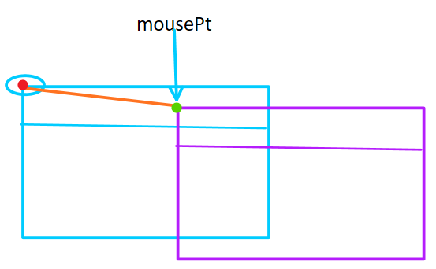
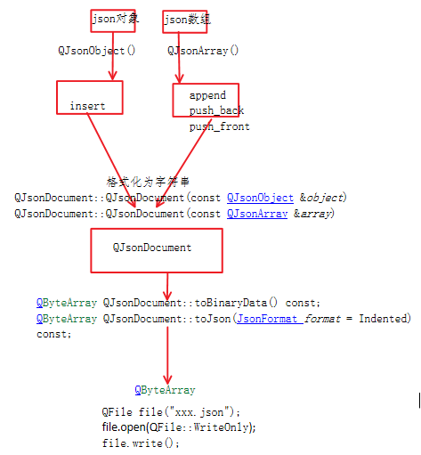
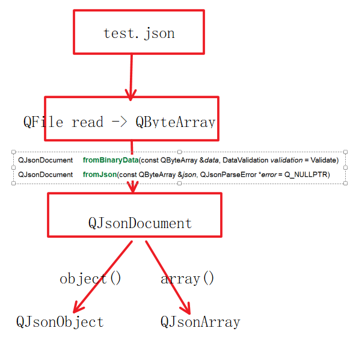

# 开发日志1

---

### 1.鼠标拖动窗口移动, 左上角坐标求解

1. 在鼠标按下还没有移动的时候求差值，差值 = 鼠标当前位置 - 屏幕左上角的点
2. 鼠标移动过程中，屏幕左上角的点 = 鼠标当前位置 - 差值



### 2.Qt中使用正则表达式进行数据校验

使用core模块下的正则表达式QRegExp类，进行数据的正则表达式校验：

1. 构造正则对象：

    `QRegExp::QRegExp();`

    `QRegExp::QRegExp(const QString &pattern, Qt::CaseSensitivity cs = Qt::CaseSensitive, PatternSyntax syntax = RegExp)`

    - pattern: 正则表达式, 该正则对象继续数据校验的规则

2. 正则对象数据校验：

    `bool QRegExp::exactMatch(const QString &str) const`

    - str: 被校验的字符串
    - 返回值: 匹配成功: true, 失败:false

3. 重新给正则对象指定匹配规则：

    `void QRegExp::setPattern(const QString &pattern)`

    - pattern: 正则表达式

<mark>正则表达式样例</mark>：

```cpp
const QString USER_REG = "^[a-zA-Z\\d_@#-\\*]\\{3,16\\}$";
const QString PASSWD_REG = "^[a-zA-Z\\d_@#-\\*]\\{6,18\\}$";
const QString PHONE_REG = "1\\d\\{10\\}";
const QString EMAIL_REG = "^[a-zA-Z\\d\\._-]\\+@[a-zA-Z\\d_\\.-]\\+(\\.[a-zA-Z0-9_-]\\+)+$";
const QString IP_REG = "((2[0-4]\\d|25[0-5]|[01]?\\d\\d?)\\.){3}(2[0-4]\\d|25[0-5]|[01]?\\d\\d?)";
const QString PORT_REG = "^[1-9]$|(^[1-9][0-9]$)|(^[1-9][0-9][0-9]$)|(^[1-9][0-9][0-9][0-9]$)|(^[1-6][0-5][0-5][0-3][0-5]$)";
```

1. `const QString USER_REG = "^[a-zA-Z\\d_@#-\\*]\\{3,16\\}$";`
    - `^`：表示匹配字符串的开始
    - `[a-zA-Z\\d_@#-\\*]`：字符集，表示可以匹配的字符集合。
        - `a-z`：小写字母范围
        - `A-Z`：大写字母范围
        - `\\d`：表示数字的范围
        - `_`：下划线字符
        - `@`、`#`、`-`、`*`：直接匹配这些特殊字符
    - `\\{3,16\\}`：限定符，表示前面的字符集可以出现的次数范围，`3,16` 表示字符集中的字符可以重复出现 3 到 16 次。
    - `$`：表示匹配字符串的结尾
2. `const QString PHONE_REG = "1\\d\\{10\\}";` 匹配中国手机号
    - `1`：直接匹配数字 1，中国手机号码通常以 1 开头
    - `\\d`：表示匹配任意数字字符，等同于 `[0-9]`
    - `\\{10\\}`：这是一个限定符，表示前面的数字可以重复出现 10 次
3. `const QString EMAIL_REG = "^[a-zA-Z\\d\\._-]\\+@[a-zA-Z\\d_\\.-]\\+(\\.[a-zA-Z0-9_-]\\+)+$";`
    - `^`：表示匹配字符串的开始
    - `[a-zA-Z\\d\\._-]`：字符集，表示可以匹配的字符集合。
        - `a-z`：小写字母范围
        - `A-Z`：大写字母范围
        - `\\d`：表示数字的范围
        - `\\._-`：包含点、下划线和短划线字符
    - `\\+`：匹配一个或多个前面的字符集
    - `@`：直接匹配字符 @
    - `[a-zA-Z\\d_\\.-]`：再次是一个字符集，表示可以匹配的字符集合，与前面类似。
        - 同理
    - `(\\.[a-zA-Z0-9_-]\\+)`：这是一个分组，用于匹配邮箱地址的域名部分，包含以下内容：
        - `\\.`：直接匹配字符点
        - `[a-zA-Z0-9_-]`：字符集，包含字母、数字、下划线和短划线
        - `\\+`：匹配一个或多个前面的字符集
    - `+`：匹配一个或多个前面的分组，即域名部分可以重复出现多次
    - `$`：表示匹配字符串的结尾
4. `const QString IP_REG = "((2[0-4]\\d|25[0-5]|[01]?\\d\\d?)\\.){3}(2[0-4]\\d|25[0-5]|[01]?\\d\\d?)";`匹配IP
    - `((2[0-4]\\d|25[0-5]|[01]?\\d\\d?)\\.)`：这是一个分组，用于匹配 IP 地址的一部分
        - `2[0-4]\\d`：匹配范围在 200 到 249 之间的数字
        - `25[0-5]`：匹配范围在 250 到 255 之间的数字
        - `[01]?\\d\\d?`：匹配范围在 0 到 199 之间的数字，可以有一个或两个数字
            - `[01]?`：表示匹配 0 或 1 出现 0 次或 1 次，用于处理数字的百位和十位。
            - `\\d`：表示匹配任意数字字符，等同于 `[0-9]`，用于处理数字的个位。
            - `\\d?`：表示匹配数字字符出现 0 次或 1 次，用于处理可能存在的个位数字。
        - `\\.`：直接匹配字符点`.`
    - `{3}`：限定符，表示前面的分组需要重复匹配 3 次
    - `(2[0-4]\\d|25[0-5]|[01]?\\d\\d?)`：用于匹配 IP 地址的最后一部分，即一个数字可以是 0 到 255 之间的任意数字
5. `const QString PORT_REG = "^[1-9]$|(^[1-9][0-9]$)|(^[1-9][0-9][0-9]$)|(^[1-9][0-9][0-9][0-9]$)|(^[1-6][0-5][0-5][0-3][0-5]$)";`，匹配端口号的范围 1 到 65535
    - `^[1-9]$`：表示匹配一个单独的数字，范围在 1 到 9 之间，
    - `(^[1-9][0-9]$)`：表示匹配两位数字，范围在 10 到 99 之间，
    - `(^[1-9][0-9][0-9]$)`：表示匹配三位数字，范围在 100 到 999 之间，
    - `(^[1-9][0-9][0-9][0-9]$)`：表示匹配四位数字，范围在 1000 到 9999 之间，
    - `(^[1-6][0-5][0-5][0-3][0-5]$)`：表示匹配五位数字，范围在 10000 到 65535 之间，但是前面的数字不能超过 65535，


### 3.Qt处理json数据

在qt中处理json数据需要使用到的类：QJsonDocument、QJsonObject

1. QJsonDocument：
    - 将字符串-> json对象/数组;
    - json对象,数组 -> 格式化为字符串
2. QJsonObject
    - QJsonObject：处理json对象{}
    - QJsonArray：处理json数组[]
    - QJsonValue：包装数据的, 字符串, 布尔, 整形, 浮点型, json对象, json数组

#### 内存中的json数据写入磁盘



#### 磁盘中的json字符串读入内存




